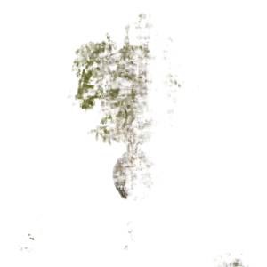
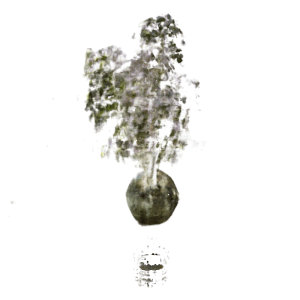
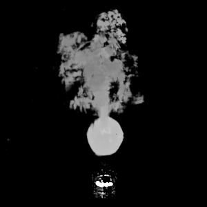

# InfoNeRF: Ray Entropy Minimization for Few-Shot Neural Volume Rendering 
### CVPR 2022
### [Project](https://cv.snu.ac.kr/research/InfoNeRF/) | [Paper](https://arxiv.org/abs/2112.15399) | [Video](https://www.youtube.com/embed/WNWuc281cQQ) 

Pytorch implementation of our method for regularizing nerual radiance fields for few-shot neural volume rendering.

<table>
  <thead>
    <tr>
      <th rowspan="2" colspan="1"></th>
      <th colspan="2">NeRF (baseline) </td>
      <th colspan="2">InfoNeRF</td>
    </tr>
    <tr>
      <th> RGB </th>
      <th> Depth </th>
      <th> RGB </th>
      <th> Depth </th>
    </tr>
  </thead>
  <tbody>
    <tr>
      <th>Lego</th>
      <td>  </td>
      <td>  </td>
      <td>  </td>
      <td>  </td>
    </tr>
    <tr>
      <th>Ficus</th>
      <td>   </td>
      <td>  </td>
      <td>  </td>
      <td>  </td>
    </tr>
    </tbody>
</table>

<b> InfoNeRF: Ray Entropy Minimization for Few-Shot Neural Volume Rendering </b>

[Mijeong Kim](https://mjmjeong.github.io/), [Seonguk Seo](https://seoseong.uk/), [Bohyung Han](https://cv.snu.ac.kr/~bhhan/)

Seoul National University

> <p align="center">  <figcaption align="center"><b></b></figcaption>
> We present an information-theoretic regularization technique for few-shot novel view synthesis based on neural implicit representation. 
> The proposed approach minimizes potential reconstruction inconsistency that happens due to insufficient viewpoints by imposing the entropy constraint of the density in each ray. 
> In addition, to alleviate the potential degenerate issue when all training images are acquired from almost redundant viewpoints,
> we further incorporate the spatially smoothness constraint into the estimated images by restricting information gains from a pair of rays with slightly different viewpoints. 
> The main idea of our algorithm is to make reconstructed scenes compact along individual rays and consistent across rays in the neighborhood. 
> The proposed regularizers can be plugged into most of existing neural volume rendering techniques based on NeRF in a straightforward way. 
> Despite its simplicity, we achieve consistently improved performance compared to existing neural view synthesis methods by large margins on multiple standard benchmarks. 


---

## Installation
```
git clone https://github.com/mjmjeong/InfoNeRF.git
cd InfoNeRF
pip install -r requirements.txt
```
or
```
git clone https://github.com/mjmjeong/InfoNeRF.git
cd InfoNeRF
conda env create -f environment.yaml
conda activate infonerf
```

## How  to Run?

### Quick Start 

To train a InfoNeRF on the example `lego` scene:
```
python run_nerf.py --config configs/infonerf/synthetic/lego.txt
```

To train a NeRF (baseline) on the example `lego` scene:
```
python run_nerf.py --config configs/nerf/synthetic/lego.txt
```

Since our setting is few-shot learning, it is enough to train the model with only 50000 iterations.

### More Datasets
To play with other scenes presented in the paper, download the data [here](https://drive.google.com/drive/folders/128yBriW1IG_3NJ5Rp7APSTZsJqdJdfc1). Place the downloaded dataset according to the following directory structure:
```
├── configs  
│   ├── ...    
│                                                                                      
├── data 
|   ├── nerf_synthetic
|   |   └── lego
|   |   └── ship    # downloaded synthetic dataset
|   |   └── ...
│   ├── DTU
│   │   └── scan1   # downloaded DTU dataset
│   │   └── scan2   # downloaded DTU dataset
|   |   └── ...
```

### Training Sequentially

To repeat the same experiments on other scenes in the same dataset, follow these steps:

First, duplicate the config files using `duplicate_config.py` file:
```
python duplicate_config.py 
```

Second, change and run `train.sh` for sequential training:
```
bash train.sh
```
---
                
## Citation

If you find our work useful in your research, please cite:

```
@inproceedings{kim2022infonerf,
            author = {Mijeong Kim and Seonguk Seo and Bohyung Han},
            booktitle = {CVPR},
            title = {InfoNeRF: Ray Entropy Minimization for Few-Shot Neural Volume Rendering},
            year = {2022}
        }
```

## Acknowlegements

This code heavily borrows from [nerf-pytorch](https://github.com/yenchenlin/nerf-pytorch) and [DS-NeRF](https://github.com/dunbar12138/DSNeRF).

